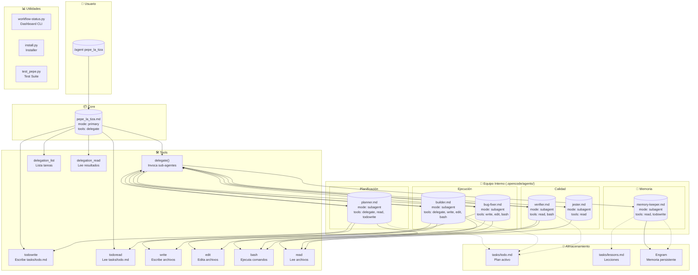
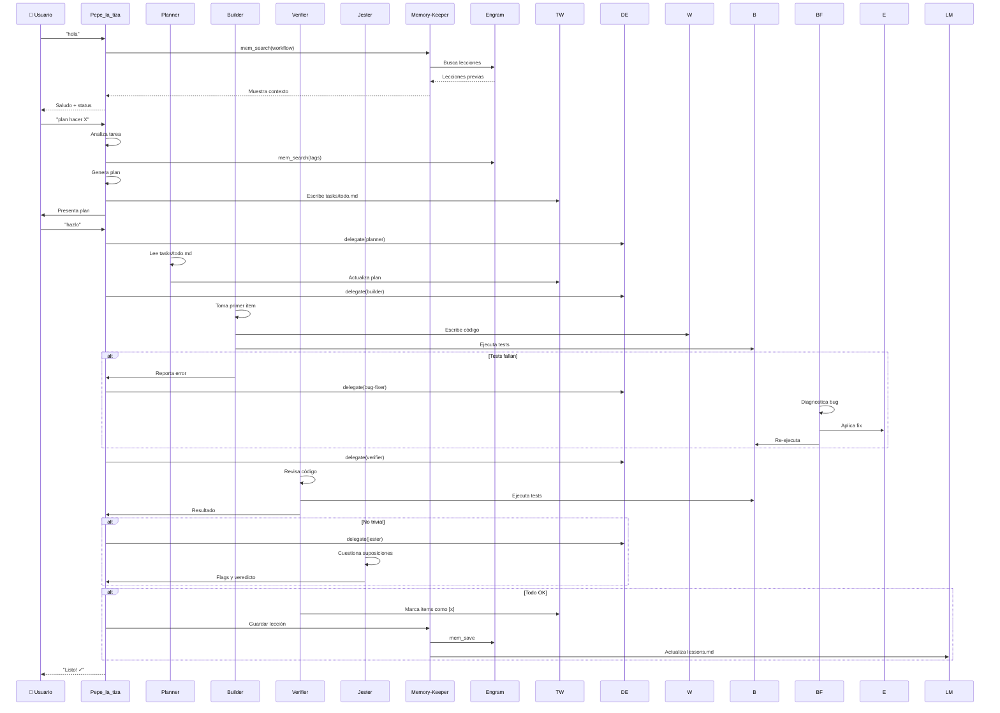
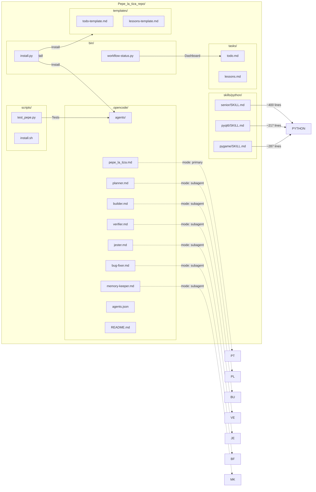
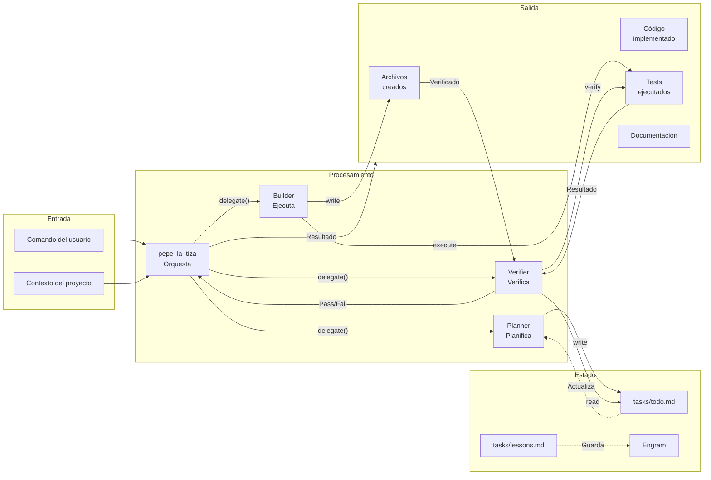

# Pepe_la_tiza — Arquitectura Completa

## Diagrama de Componentes

---

## Diagrama de Flujo de Delegación

---

## Mapa de Archivos

---

## Tabla de Herramientas por Agente

| Agente | delegate | todowrite | todoread | read | write | edit | bash | mem_* |
|--------|----------|-----------|----------|------|-------|------|------|-------|
| **pepe_la_tiza** | ✅ | ✅ | ✅ | - | - | - | - | - |
| **planner** | ✅ | ✅ | ✅ | ✅ | - | - | - | ✅ |
| **builder** | ✅ | - | - | ✅ | ✅ | ✅ | ✅ | - |
| **verifier** | - | - | - | ✅ | - | - | ✅ | - |
| **jester** | - | - | - | ✅ | - | - | - | - |
| **bug-fixer** | ✅ | - | - | ✅ | ✅ | ✅ | ✅ | ✅ |
| **memory-keeper** | - | ✅ | - | ✅ | - | - | - | ✅ |

---

## Flujo de Datos

---

*Generado: Release 1.0 - Arquitectura Pepe_la_tiza*